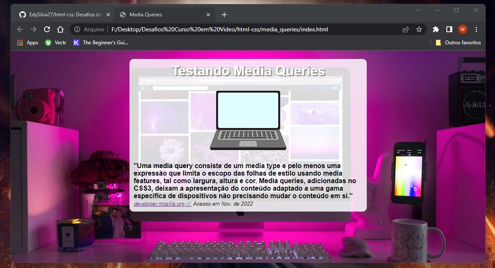

<h1 align="center"> Media Queries </h1>

Projeto desenvolvido no módulo 4 do curso de HTML5 e CSS3 do Curso em Vídeo.

  <a href="#-tecnologias">Tecnologias</a>&nbsp;&nbsp;&nbsp;|&nbsp;&nbsp;&nbsp;
  <a href="#-projeto">Projeto</a>&nbsp;&nbsp;&nbsp;|&nbsp;&nbsp;&nbsp;
  <a href="#-layout">Layout</a>&nbsp;&nbsp;&nbsp;|&nbsp;&nbsp;&nbsp;
  <a href="#memo-licença">Licença</a>

  

 

  

## 🚀 Tecnologias

Esse projeto foi desenvolvido com as seguintes tecnologias:

- HTML e CSS
- Github Desktop
- Github Pages
- Gimp

## 💻 Projeto

O projeto consiste em página desenvolvida com o método Mobile First e aplicação de media queries apresentando como resultado um conteúdo adaptavel a todos os tamanhos de tela e também um conteúdo com um estilo único para impressão.

## 🔖 Layout

Você pode visualizar o layout do projeto através [DESSE LINK](https://github.com/EdySilva27?tab=repositories).

## :memo: Licença

Esse projeto está sob a licença MIT.

---

by Edy Silva :wave: [Linkedin](https://www.linkedin.com/in/edysilva27/)
